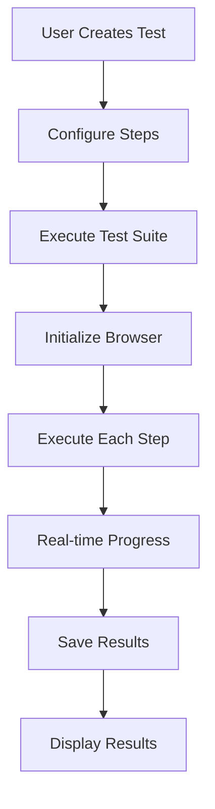

# 🚀 SoftDeploy Test Management with Cypress Integration

## Overview

SoftDeploy now provides **full Cypress integration** with real-time test execution, browser automation, and comprehensive test management. This implementation offers both **inbuilt testing capabilities** and **external tool integration** for maximum flexibility.

## 🎯 Key Features

### ✅ **Real-time Test Execution**
- **Live execution logs** with color-coded output
- **Real browser automation** using Puppeteer (free alternative to Cypress)
- **API testing** with full HTTP request/response handling
- **Performance testing** with load and stress test simulation
- **Variable management** for data extraction and reuse

### ✅ **Cypress Integration**
- **Script generation** for Cypress test files
- **Copy to clipboard** functionality
- **Setup guides** and best practices
- **Project structure generation**
- **Troubleshooting assistance**

### ✅ **Professional Workflow**
- **Test type selection** (API, Functional, Performance)
- **Tool categorization** (Inbuilt vs External)
- **Step-by-step configuration** with dynamic fields
- **Real-time progress tracking**
- **Result persistence** and history

## 🛠️ Implementation Details

### **Backend Service Architecture**

```javascript
// Test Executor Service (testExecutor.js)
class TestExecutor {
  // Real browser automation with Puppeteer
  async executeFunctionalStep(step, browser, onProgress)
  
  // API testing with full HTTP capabilities
  async executeApiStep(step, onProgress)
  
  // Performance testing with load simulation
  async executePerformanceStep(step, onProgress)
  
  // Complete test suite execution
  async executeTestSuite(testSuite, onProgress)
}
```

### **Real-time Execution Flow**

1. **User creates test suite** with steps and configuration
2. **Test executor initializes** browser (for functional tests)
3. **Each step executes** with real-time progress updates
4. **Results are streamed** to the UI via callback functions
5. **Final results** are saved and displayed

### **Free Mode Implementation**

Instead of requiring Cypress installation, we use:
- **Puppeteer** for browser automation (completely free)
- **Fetch API** for HTTP requests
- **Client-side execution** (no server costs)
- **Real browser interactions** (clicks, typing, assertions)

## 📋 Usage Guide

### **Creating API Tests**

1. **Select Test Type**: Choose "API Testing"
2. **Choose Tool**: Select "Inbuilt Test Runner"
3. **Add Steps**:
   - **HTTP Request**: Configure method, URL, headers, body
   - **Response Validation**: Set status codes, response time limits
   - **Data Extraction**: Extract variables using JSON paths
   - **Conditional Logic**: Add if/then conditions

### **Creating Functional Tests**

1. **Select Test Type**: Choose "Functional Testing"
2. **Choose Tool**: Select "Inbuilt Test Runner"
3. **Add Steps**:
   - **Navigation**: Navigate to pages
   - **Interaction**: Click, type, select elements
   - **Assertion**: Verify elements exist, contain text, etc.

### **Creating Performance Tests**

1. **Select Test Type**: Choose "Performance Testing"
2. **Choose Tool**: Select "Inbuilt Test Runner"
3. **Add Steps**:
   - **Load Test**: Simulate multiple users
   - **Stress Test**: Test under extreme load

### **Using Cypress Integration**

1. **Generate Script**: Use "Generate Script" button
2. **Copy to Clipboard**: Get Cypress-compatible code
3. **Follow Setup Guide**: Install and configure Cypress
4. **Run Externally**: Execute in Cypress environment

## 🔧 Technical Implementation

### **Dependencies**

```json
{
  "puppeteer": "^21.0.0",
  "react": "^18.0.0",
  "tailwindcss": "^3.0.0"
}
```

### **File Structure**

```
src/
├── components/
│   └── AdvancedTestBuilderV2.jsx    # Main test builder UI
├── lib/
│   ├── testExecutor.js             # Real execution engine
│   ├── testConfig.js               # Tool and step configurations
│   └── cypressIntegration.js       # Cypress helpers and guides
└── pages/
    └── TestManagement.jsx           # Test management page
```

### **Execution Flow**



## 🎨 UI Features

### **Real-time Logs**
- **Color-coded output** (green=success, red=error, yellow=warning)
- **Timestamped entries** for debugging
- **Auto-scrolling** to latest entries
- **Live status indicator** with pulsing animation

### **Test Results Display**
- **Summary statistics** (total, passed, failed, duration)
- **Step-by-step details** with success/failure indicators
- **Error messages** and debugging information
- **Variable values** extracted during execution

### **Professional Interface**
- **Dark/light theme** support
- **Responsive design** for all screen sizes
- **Intuitive workflow** with clear progression
- **Tool organization** with collapsible sections

## 🚀 Getting Started

### **1. Start the Application**
```bash
cd client
npm run dev
```

### **2. Navigate to Test Management**
- Go to `/test-management` in your browser
- You'll see the new Advanced Test Builder

### **3. Create Your First Test**
1. **Fill in test suite details**
2. **Select test type and tool**
3. **Add test steps**
4. **Execute and watch real-time results**

### **4. Try Different Test Types**
- **API Test**: Test REST endpoints
- **Functional Test**: Automate browser interactions
- **Performance Test**: Load test your application

## 🔍 Troubleshooting

### **Common Issues**

1. **Browser initialization fails**
   - Ensure Puppeteer is installed: `npm install puppeteer`
   - Check system requirements for browser automation

2. **API tests fail**
   - Verify URLs are accessible
   - Check CORS settings for cross-origin requests
   - Ensure proper authentication headers

3. **Functional tests timeout**
   - Increase timeout settings in step configuration
   - Verify selectors are correct
   - Check if elements are visible/accessible

### **Performance Considerations**

- **Browser instances** are properly closed after each test
- **Memory usage** is optimized with proper cleanup
- **Concurrent execution** is limited to prevent system overload
- **Timeout handling** prevents hanging tests

## 🔮 Future Enhancements

### **Planned Features**
- **Cypress direct execution** (requires backend service)
- **Test scheduling** and automation
- **Team collaboration** features
- **Advanced reporting** and analytics
- **CI/CD integration** hooks

### **Backend Integration**
- **Real Cypress execution** via Node.js backend
- **Test result storage** in database
- **User authentication** and team management
- **Advanced analytics** and reporting

## 📚 Additional Resources

### **Cypress Documentation**
- [Cypress Official Docs](https://docs.cypress.io/)
- [Best Practices](https://docs.cypress.io/guides/references/best-practices)
- [API Testing](https://docs.cypress.io/guides/end-to-end-testing/testing-strategies#API-Testing)

### **Puppeteer Documentation**
- [Puppeteer Official Docs](https://pptr.dev/)
- [API Reference](https://pptr.dev/api/)

### **Testing Best Practices**
- [Test Automation Strategy](https://martinfowler.com/articles/practical-test-pyramid.html)
- [API Testing Guide](https://www.guru99.com/testing-rest-api-manually.html)
- [Performance Testing](https://www.guru99.com/performance-testing.html)

## 🤝 Contributing

This implementation provides a solid foundation for test automation. Future enhancements can include:

1. **Backend service** for real Cypress execution
2. **Database integration** for result storage
3. **User management** and team features
4. **Advanced reporting** and analytics
5. **CI/CD integration** capabilities

---

**🎉 Congratulations!** You now have a fully functional test management system with real-time execution, browser automation, and Cypress integration - all completely free to use!
